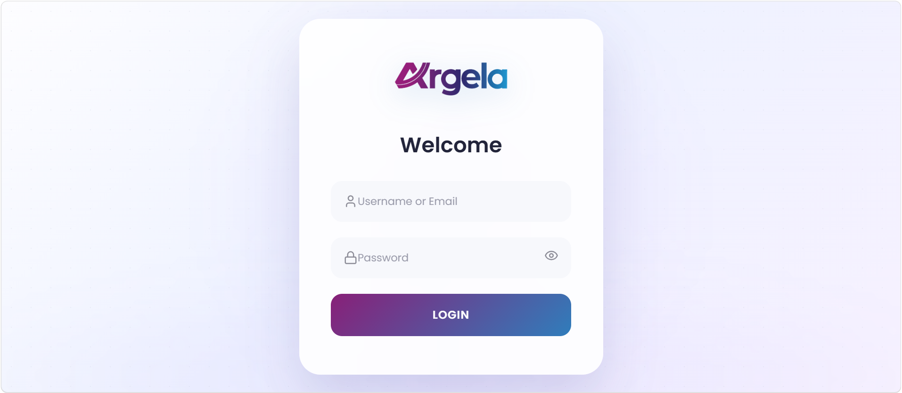
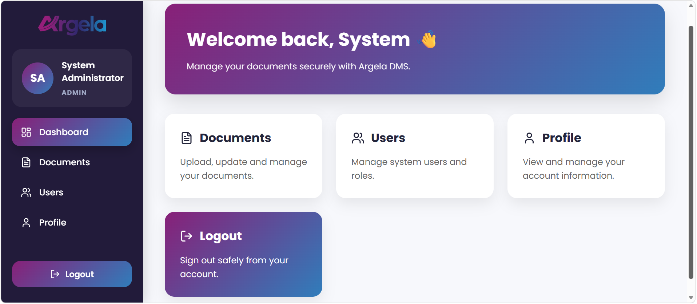
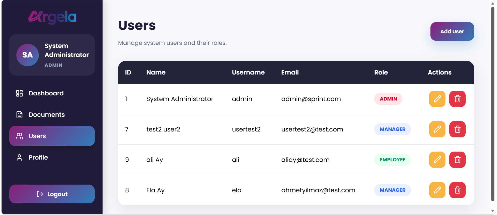
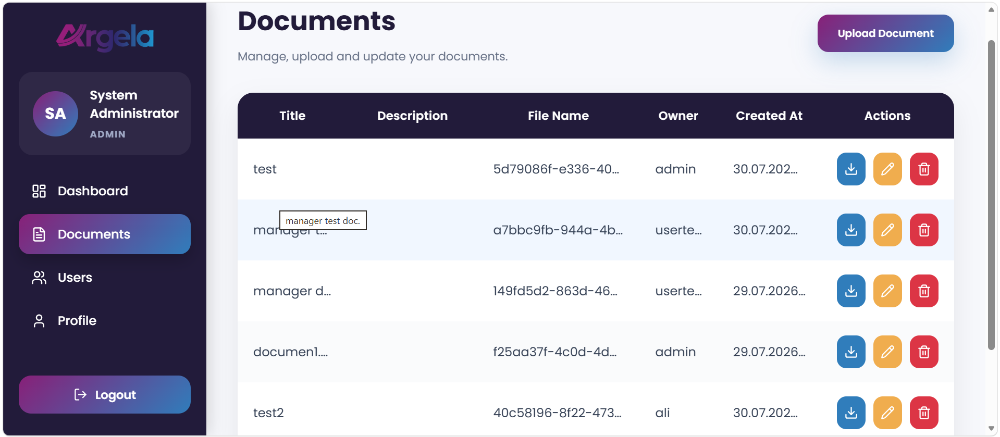
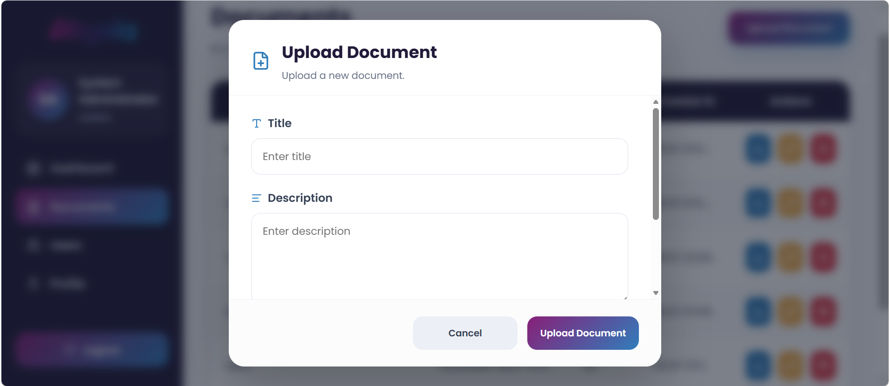
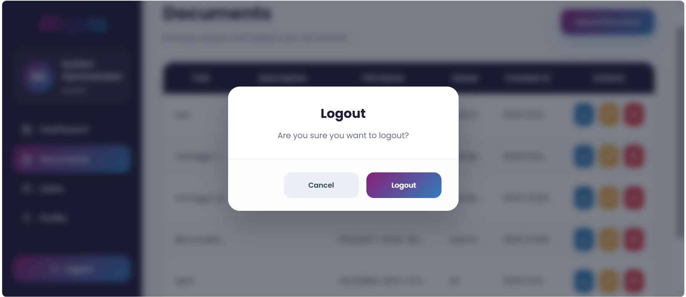

# Document Management System

A secure full-stack **Document Management System** developed with **Spring Boot**, **React**, and **PostgreSQL** as part of a Spring Security internship project.

The application provides secure authentication, role-based authorization, user management, document management, audit logging, refresh token authentication, and rate limiting while offering a modern and responsive user interface.

---

# Features

## Authentication & Security

- JWT Access Token Authentication
- Refresh Token Authentication
- Spring Security
- BCrypt Password Encryption
- Session Expiration Handling
- Role-Based Access Control (RBAC)
- Ownership-Based Authorization
- Bucket4j Rate Limiting
- Audit Logging
- Global Exception Handling
- CORS Configuration

---

## User Management

- Create User
- Update User
- Delete User
- View All Users
- View Current User Information

---

## Document Management

- Upload Documents
- Update Documents
- Delete Documents
- Download Documents
- View Document Details
- List Documents

### Upload Validation

- File type validation
- File size validation (10 MB)
- File replacement during update

---

# Authorization Rules

| Role | View Documents | Modify Own Documents | Modify Other Documents | User Management |
|------|----------------|----------------------|------------------------|-----------------|
| ADMIN | ✅ All | ✅ | ✅ | ✅ |
| MANAGER | ✅ All | ✅ | ❌ | ❌ |
| EMPLOYEE | ✅ Own Only | ✅ | ❌ | ❌ |

---

# Frontend Features

Built with **React + Vite**

- Responsive Dashboard
- Modern Login Page
- User Management Interface
- Document Management Interface
- Session Expired Modal
- Logout Confirmation Dialog
- Login Validation
- Document Upload Validation
- Error Handling
- Loading States
- Responsive Sidebar

---

# Backend Features

- RESTful API
- DTO Architecture
- Spring Data JPA
- File Upload & Download
- Ownership Authorization
- Audit Logging
- Refresh Token Support
- Bucket4j Rate Limiting
- Docker Support

---

# Tech Stack

## Backend

- Java 21
- Spring Boot 3
- Spring Security
- Spring Data JPA
- PostgreSQL
- JWT
- Bucket4j
- Maven

## Frontend

- React
- Vite
- Axios
- React Router
- Bootstrap
- Lucide React

## Database

**PostgreSQL**

Database Name

```text
sprint1_db_8082
```

## DevOps

- Docker
- Docker Compose

---

# Project Structure

```text
backend
│
├── audit
├── config
├── controller
├── dto
├── entity
├── exception
├── repository
├── security
└── service

frontend
│
├── components
├── pages
├── router
├── services
└── styles

uploads
docker-compose.yml
Dockerfile
```

---

# REST API

## Authentication

| Method | Endpoint |
|---------|----------|
| POST | /auth/login |
| POST | /auth/logout |
| POST | /auth/refresh |

## Users

| Method | Endpoint |
|---------|----------|
| GET | /users |
| GET | /users/{id} |
| GET | /users/me |
| POST | /users |
| PUT | /users/{id} |
| DELETE | /users/{id} |

## Documents

| Method | Endpoint |
|---------|----------|
| GET | /documents |
| GET | /documents/{id} |
| POST | /documents |
| PUT | /documents/{id} |
| DELETE | /documents/{id} |
| GET | /documents/{id}/download |

---

# API Documentation

Swagger UI

**Local URL**

```text
http://127.0.0.1:8082/swagger-ui/index.html
```

---

# Installation

## Clone Repository

```bash
git clone https://github.com/aydyaren/Spring-Security-Staj-Projesi--Sprint1.git
```

## Start Backend

```bash
docker compose up --build
```

## Start Frontend

```bash
cd frontend

npm install

npm run dev
```

---

## Frontend Environment Variable

Create a `.env` file inside the frontend directory.

```env
VITE_API_URL=http://127.0.0.1:8082
```

---

# Screenshots

- Login Page

- Dashboard

- User Management

- Document Management

- Upload Document

- Logout Confirmation Dialog

- Session Expired Modal


---

# Future Improvements

- Pagination
- Search & Filtering
- File Preview
- Drag & Drop Upload
- Email Notifications
- Two-Factor Authentication (2FA)

---

# Author

**Yaren Aydın**

Spring Security Internship Project